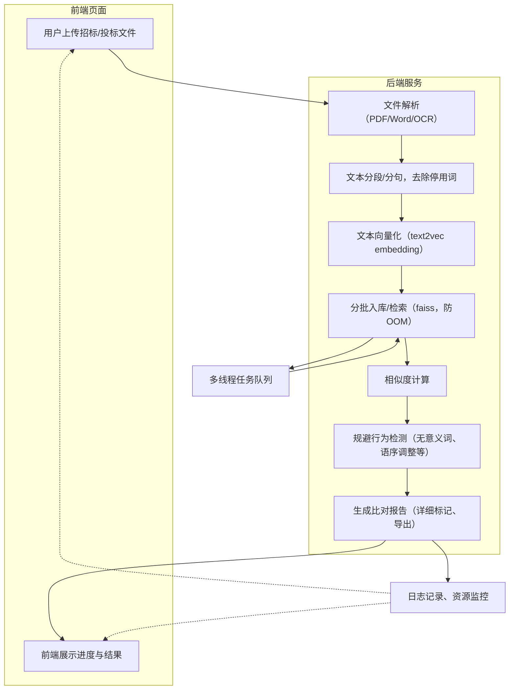

# 投标文件相似度检测系统

本项目基于 FastAPI + 本地 text2vec 语义模型，支持大体量招标/投标文件的智能雷同分析，自动检测语义雷同、规避行为（如语序调整、无意义词插入）、语法错误等，支持结果导出为 JSON/Excel。

---

## 主要功能

- 支持上传招标文件和多份投标文件（PDF/Word）
- 自动分段、去除无意义词、语法错误检测
- 剔除投标文件中参考/摘抄招标文件内容
- 投标文件间语义雷同分析，定位页码、内容、相似文件、相似度等
- 检测规避行为（如语序调整、无意义词插入）
- 检测多份文件中相同语法错误
- 分析结果一键导出为 JSON/Excel
- 任务队列管理，支持并发处理
- Docker 容器化部署



## 快速开始

### 方式一：Docker 部署（推荐）

1. **克隆项目**

```bash
git clone <your-repo-url>
cd bidding-docs-similarity
```

2. **准备本地模型**

```bash
python download_model.py
```
这将自动下载`shibing624/text2vec-base-chinese`模型并保存到`local_text2vec_model/`目录。

3. **构建Docker镜像**

```bash
docker build -t bidding-docs-similarity .
```

4. **启动服务**

```bash
docker run -d --name bidding-similarity-app -p 8020:8020 bidding-docs-similarity
```

或使用docker-compose：

```bash
docker-compose up --build -d
```

5. **访问系统**

- 前端界面：http://localhost:8020
- API 文档：http://localhost:8020/docs

### 方式二：本地部署

1. **准备环境**
   - 确保已安装 Python 3.12 或更高版本
   - 安装系统依赖：
     - 对于 Linux/Debian：`sudo apt-get install gcc g++ tesseract-ocr tesseract-ocr-chi-sim libgl1-mesa-glx`
     - 对于 CentOS/RHEL：`sudo yum install gcc gcc-c++ tesseract tesseract-langpack-chi_sim mesa-libGL`
     - 对于 Windows：下载并安装[Tesseract OCR](https://github.com/UB-Mannheim/tesseract/wiki)，并添加到系统环境变量

2. **安装依赖**

```bash
# 推荐使用uv进行更快的安装
pip install uv
uv pip install -r requirements.txt

# 或使用标准pip
pip install --upgrade pip
pip install -r requirements.txt
```

3. **准备本地模型**

```bash
python download_model.py
```
这将自动下载`shibing624/text2vec-base-chinese`模型并保存到`local_text2vec_model/`目录。

4. **启动服务**

```bash
python -m app.main
```

或使用uvicorn：

```bash
uvicorn app.main:app --host 0.0.0.0 --port 8020 --reload
```

5. **访问系统**

- 前端界面：http://localhost:8020
- API 文档：http://localhost:8020/docs

---

## 使用说明

1. 访问前端页面，点击右上角"任务管理"可查看所有分析任务。
2. 上传招标文件和多份投标文件（支持 PDF/Word，单个文件可达千页）。
3. 点击"开始分析"，系统自动分析并展示进度。
4. 分析完成后，页面展示雷同片段、语法错误、规避行为等详细结果。
5. 可一键导出分析结果为 JSON 或 Excel。
6. 在任务管理中可查看历史任务、取消任务、查看结果等。

---

## 主要依赖

- fastapi
- uvicorn
- python-multipart
- pdfplumber
- python-docx
- sentence-transformers
- torch
- numpy
- language_tool_python
- openpyxl

---

## 目录结构

```
bidding-docs-similarity/
├─ app/
│   ├─ main.py              # FastAPI 启动入口
│   ├─ router/
│   │    └─ similarity.py   # 路由
│   ├─ service/
│   │    ├─ similarity_service.py  # 业务逻辑
│   │    └─ text_utils.py   # 文本处理工具
│   └─ static/
│        └─ index.html      # 前端页面
├─ local_text2vec_model/    # 本地模型目录
├─ tmp_files/               # 临时文件目录
├─ requirements.txt
├─ stopwords.txt            # 无意义词表
├─ Dockerfile               # Docker 镜像构建
├─ docker-compose.yml       # Docker Compose 配置
├─ .dockerignore            # Docker 忽略文件
└─ README.md
```

---

## API 接口

### 文件上传

- `POST /api/similarity/upload` - 上传招标和投标文件

### 分析任务

- `POST /api/similarity/analyze` - 发起分析任务
- `GET /api/similarity/result` - 查询分析结果
- `GET /api/similarity/tasks` - 获取所有任务列表
- `POST /api/similarity/cancel_task` - 取消任务
- `POST /api/similarity/cleanup_tasks` - 清理过期任务

### 结果导出

- `GET /api/similarity/export_excel` - 导出 Excel 结果

---

## 常见问题

### 安装相关

- **多个顶级包错误**：如果安装时出现 `Multiple top-level packages discovered` 错误，这是由于项目根目录下存在多个Python包或数据目录。我们已经在`pyproject.toml`中通过`[tool.setuptools] packages = ["app"]`解决了这个问题。
- **依赖安装失败**：某些依赖（如torch、paddlepaddle）体积较大，安装可能需要较长时间或特定网络环境。推荐使用`uv`进行更快的安装：`pip install uv && uv pip install -r requirements.txt`。
- **Python版本不兼容**：项目需要Python 3.12或更高版本，请检查您的Python版本：`python --version`。

### 模型相关

- **模型加载报错**：请确保 `sentence-transformers` 版本与模型兼容，建议 `pip install -U sentence-transformers`。
- **模型路径**：确保 `local_text2vec_model/` 目录包含完整的模型文件。

### 部署相关

- **Docker 构建失败**：检查 Docker 和 Docker Compose 版本，建议使用最新版本。
- **端口冲突**：如 8020 端口被占用，可修改 `docker-compose.yml` 中的端口映射。
- **内存不足**：大文件分析需要足够内存，建议至少 4GB RAM。

### 性能相关

- **大文件性能**：系统已做分块与进度反馈，建议服务器内存充足。
- **并发限制**：默认最多同时运行 3 个分析任务，可在代码中调整。

### 访问相关

- **/docs 无法访问**：请确认服务已正常启动且无端口冲突。
- **文件上传失败**：检查文件格式和大小限制。

---

## 开发说明

### 本地开发

```bash
# 安装开发依赖
pip install -r requirements.txt

# 启动开发服务器
python -m app.main

# 或使用 uvicorn
uvicorn app.main:app --reload --host 0.0.0.0 --port 8000
```

### 代码结构

- `app/main.py` - FastAPI 应用入口
- `app/router/` - API 路由定义
- `app/service/` - 业务逻辑实现
- `app/static/` - 前端静态文件

---

## 联系与支持

如有问题或建议，欢迎 issue 或联系作者。
