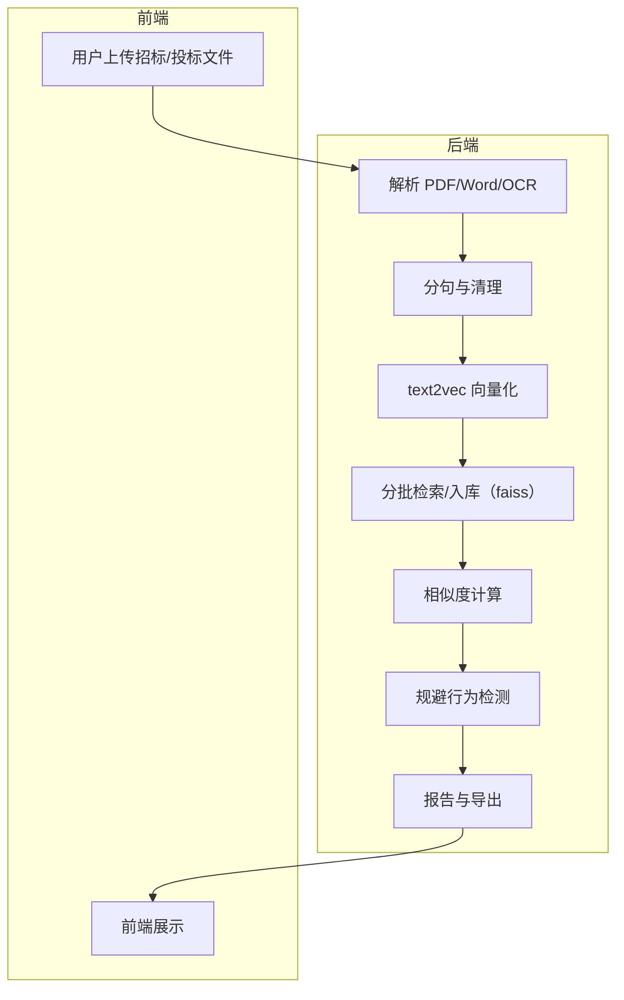

# 投标文件相似度检测系统

基于 FastAPI 与本地 text2vec 语义模型，实现大体量招投标文件的语义雷同检测与规避行为识别，支持 OCR 表格/文本识别与结果导出。

**新增**：集成 PaddleOCR，高精度中文文本与表格识别。

---

## 功能特性

- 上传招标文件与多份投标文件（PDF/Word）
- 文本分句、无意义词清理、语法错误检测
- 剔除对招标文件的引用/摘抄内容
- 跨投标文件语义雷同分析：页码、片段、来源文件、相似度
- 规避行为检测：语序调整、无意义词插入等
- OCR 文本与表格识别（PaddleOCR）
- JSON/Excel 导出、一键生成比对报告
- 并发任务队列、容器化部署



## 快速开始

### 方式一：Docker（推荐）

1) 克隆并进入项目

```bash
git clone <your-repo-url>
cd bidding-docs-similarity
```

2) 下载本地模型（首启前执行一次）

```bash
python download_model.py
```

3) 构建镜像

```bash
docker build -t bidding-docs-similarity .
```

4) 运行容器（Dockerfile 默认监听 8020）

```bash
docker run -d --name bidding-similarity-app \
  -p 8020:8020 \
  -v %cd%/local_text2vec_model:/app/local_text2vec_model:ro \
  -v %cd%/stopwords.txt:/app/stopwords.txt:ro \
  -v %cd%/tmp_files:/app/tmp_files \
  bidding-docs-similarity
```

或使用 docker-compose（请将端口映射改为 `8020:8020` 再启动）：

```bash
docker compose up --build -d
```

5) 访问

- 前端页面：`http://localhost:8020`
- API 文档：`http://localhost:8020/docs`

### 方式二：本地运行（Windows/Linux/Mac）

1) 环境准备

- Python ≥ 3.10
- 系统依赖：
  - Debian/Ubuntu: `sudo apt-get install gcc g++ libgl1-mesa-glx libglib2.0-0`
  - CentOS/RHEL: `sudo yum install gcc gcc-c++ mesa-libGL glib2`
  - Windows: 安装 PaddleOCR 运行所需依赖，确保可用的 CPU 版本 PaddlePaddle

2) 安装依赖（基于 pyproject）

```bash
pip install uv
uv pip install -e .
# 或使用 pip： pip install -e .
```

3) 下载模型

```bash
python download_model.py
```

4) 启动服务

```bash
uvicorn app.main:app --host 0.0.0.0 --port 8000 --reload
```

5) 访问

- 前端页面：`http://localhost:8000`
- API 文档：`http://localhost:8000/docs`

---

## 使用说明

### 相似度分析

1. 打开前端页面，上传招标文件与多份投标文件（支持大文件）。
2. 点击“开始分析”，查看实时进度。
3. 完成后查看：雷同片段、相似度、来源文件/页码、语法错误、规避行为。
4. 支持导出 JSON/Excel。

### OCR

- 对扫描 PDF/图片自动执行 OCR；保留页码、文本与表格结构。
- 可通过接口单独调用：`/api/ocr/recognize`、`/api/ocr/pdf_to_text`。

---

## 依赖（节选）

- fastapi、uvicorn、python-multipart
- pdfplumber、pymupdf、python-docx
- sentence-transformers、torch、faiss-cpu、numpy
- language-tool-python、openpyxl
- paddlepaddle、paddleocr、opencv-python

---

## 项目结构

```
bidding-docs-similarity/
├─ app/
│   ├─ main.py
│   ├─ config/
│   ├─ router/
│   ├─ service/
│   └─ static/
├─ local_text2vec_model/
├─ extracted_texts/
├─ logs/
├─ output/
├─ stopwords.txt
├─ Dockerfile
├─ docker-compose.yml
├─ OCR_API_DOCS.md
├─ download_model.py
├─ pyproject.toml
└─ README.md
```

---

## API（节选）

### 文件上传与任务

- `POST /api/similarity/upload` 上传文件
- `POST /api/similarity/analyze` 发起分析
- `GET /api/similarity/tasks` 任务列表
- `POST /api/similarity/cancel_task` 取消任务
- `POST /api/similarity/cleanup_tasks` 清理过期任务
- `GET /api/similarity/result` 查询结果
- `GET /api/similarity/export_excel` 导出 Excel

### OCR

- `POST /api/ocr/recognize`
- `POST /api/ocr/pdf_to_text`

---

## 常见问题

- 端口不一致：容器内默认 8020；本地开发示例使用 8000。使用 docker-compose 时请将 `ports` 改为 `"8020:8020"`。
- 依赖安装慢：建议 `pip install uv` 后使用 `uv pip install -e .`。
- 模型缺失：首次运行需执行 `python download_model.py`，确保 `local_text2vec_model/` 目录完整。
- PaddleOCR（CPU）默认启用；若需 GPU，请按官方文档安装对应版本并配置环境变量。
- **CDN不稳定**：已实现本地优先 + CDN备用方案。运行 `python download_bootstrap.py` 下载本地资源，详情见 `BOOTSTRAP_LOCAL_SETUP.md`。

---

## 开发

```bash
# 安装依赖（开发模式）
pip install uv && uv pip install -e .

# 启动开发服务
uvicorn app.main:app --reload --host 0.0.0.0 --port 8000
```

---

## 反馈

如有问题或建议，欢迎提交 Issue 或联系作者。
